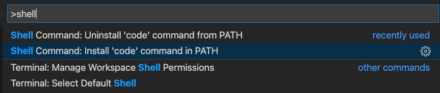

# Enable Code Command On Terminal

## Easiest Method

Use VSCode’s UI to accomplish the same thing. Press Command-Shift-P, enter “shell” and select “Shell Command: Install ‘code’ command in PATH”.


## Alternative Method

In terminal,

```sh
ln -s "/Applications/Visual Studio Code.app/Contents/Resources/app/bin/code" /usr/local/bin/code
```

This creates a symbolic link to the code executable in a directory where your shell usually looks for executables (`/usr/local/bin/code`). Should now be able to use `code .` as expected.
