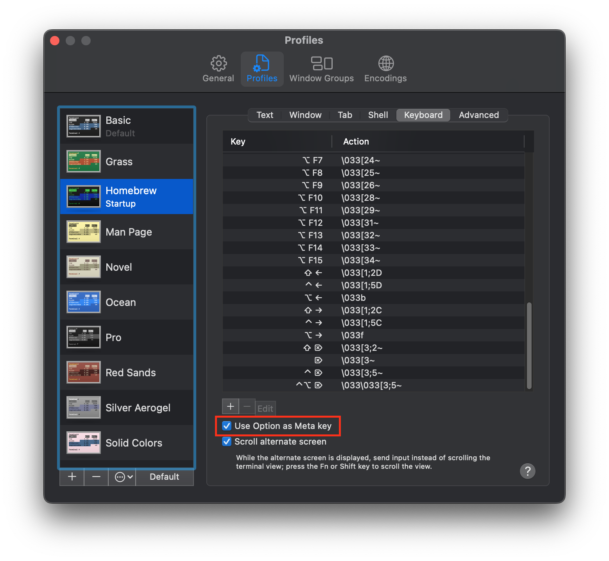

# macOS Terminal Navigation

## **Enable option key as meta key**

1. Go to `Terminal` > `Preferences` > `Profiles` > `Keyboard` (shortcut: `cmd` + `,` )
2. Enable `Use option key as meta key`.
  
3. Now you can delete word by word using `option` + `delete` (forward delete)

## Delete, copy, and paste

`Ctrl` + `w`: deletes previous word (as does Meta+delete but whole word, meaning space separated)

`Ctrl` + `u`: delete from cursor to start of line

`Ctrl` + `k`: delete from cursor to end of line

`Ctrl` + `y`: Paste previously deleted text

`Ctrl` + `-`: undo from the last edit; can undo all the back to empty line

## Navigation (moving around)

`Ctrl` + `a`: go to beginning of line

`Ctrl` + `e`: go to end of line

`option` + (left and right arrow keys): Move word by word

## Most handy (history)

`Ctrl` + `r`: Incrementally search the line history

`Ctrl` + `g`: Abort incremental search and restore original line

`Ctrl` + `l`: clear screen
